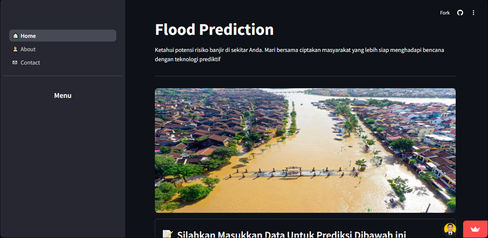

# Flood Prediction App

Gambar 1. Preview Aplikasi

## Tentang Aplikasi
Flood Prediction App adalah aplikasi prototipe yang dirancang untuk memprediksi kemungkinan terjadinya banjir berdasarkan data lingkungan dan infrastruktur. Aplikasi ini dibangun menggunakan teknologi Machine Learning dan dikembangkan sebagai bagian dari proyek capstone yang bertujuan untuk membantu mitigasi bencana banjir dengan menyediakan sistem pendukung keputusan yang cepat dan mudah digunakan.

## Tujuan Pengembangan
Aplikasi ini bertujuan untuk memberikan informasi yang akurat dan cepat mengenai risiko banjir di suatu wilayah, sehingga masyarakat dapat mengambil tindakan pencegahan yang diperlukan. Dengan menggunakan data lingkungan dan algoritma Machine Learning, aplikasi ini dapat memprediksi kemungkinan terjadinya banjir berdasarkan berbagai faktor seperti curah hujan, kondisi lingkungan yang ada.

## Teknologi yang Digunakan
Model ML: Keras + TensorFlow, model yang dibangun berbasis data lingkungan.
Frontend: Streamlit (Python Web App Framework).
Tools: Google Colaboratory, Streamlit, Git.
Library Pendukung: OS, Shutil, Pandas, Numpy, Matplotlib, Seaborn, Tensorflow, Google.colab.drive, Scikit-learn, dan Scikeras.

## Model yang Dibangun
Model ANN dan DNN yang dibandingkan kemudian dievaluasi menggunakan metrik MAE. Diperoleh MAE 0.0320 untuk model ANN dengan feature engineering untuk digunakan pada aplikasi.

## Dataset
Proyek ini menggunakan dataset Flood Prediction oleh Naiya Khalid yang diperoleh dari Kaggle. Dataset ini berisi berbagai fitur terkait curah hujan, kelembapan, dan parameter geografis yang relevan dengan risiko banjir.

Link Akses: [Flood Prediction Dataset](https://www.kaggle.com/datasets/naiyakhalid/flood-prediction-dataset/data).

## Fitur Aplikasi

- **Prediksi Banjir**
  Memprediksi banjir berdasarkan fitur Moon Soon Intensity (Curah hujan), Urbanization (Kepadatan penduduk), Coastal Vulnerability (Kerentanan Pesisir), Siltation (Pengendapan Sedimen), WetlandLoss (Kehilangan Lahan Basah), Deforestation (Deforestasi), dan Encroachments (Alih Fungsi Lahan).
- **Peringatan Dini**
  Peringatan dini berupa *AMAN* dan *ALERT*. Fitur ini memberitahukan pengguna situasi dimana mereka perlu siap siaga untuk menghadapi banjir.
- **Rekomendasi Sosialisasi**
  Menyediakan rekomendasi kegiatan sosialisasi yang dapat dilakukan kepada masyarakat untuk meningkatkan kesiapsiagaan.
- **About**
  Menampilkan deskripsi singkat mengenai aplikasi dan pengembang.
- **Contact**
  Kontak dari developer.

## Cara Menjalankan Aplikasi

### **Local**
**1. Clone repository ini ke komputer lokal**
```
git@github.com:teguhh18/Capstone_LaskarAI_LAI25-SM089.git
```
**2. Setup Environment**
**Menggunakan Virtualenv (Python bawaan)**
```
# Membuat virtual environment
python -m venv env

# Aktivasi environment (Windows)
env\Scripts\activate

# Aktivasi environment (Mac/Linux)
source env/bin/activate

# Install dependensi
pip install --upgrade pip
pip install -r flood_prediction_app/requirements.txt
```
**Anaconda**
```
conda create --name main-ds python=3.9
conda activate main-ds
pip install -r flood_prediction_app/requirements.txt
```
**Shell/Terminal**
```
mkdir proyek_analisis_data
cd proyek_analisis_data
pipenv install
pipenv shell
pip install -r flood_prediction_app/requirements.txt
```
**3. Buka direktori yang memiliki 🏠_Home.py in anaconda**
```
cd ...\Capstone_LaskarAI_LAI25-SM089\flood_prediction_app\🏠_Home.py
```
**4. Run steamlit app**
```
streamlit run 🏠_Home.py
```

### **Online (Streamlit)**
Aplikasi juga dapat diakses [di sini](https://flood-prediction-laskar-ai.streamlit.app).

## Lisensi
Proyek ini dibuat untuk tujuan pembelajaran dan pengembangan dalam program Laskari AI. Tidak untuk penggunaan komersial tanpa izin.
